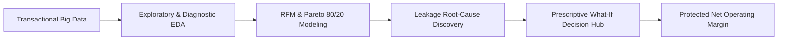

# 💼 Data Analysis & Strategic Business Intelligence Portfolio
### *Curated by Nur Alief Maulana — Data Analyst & Commercial Analytics Specialist*

[](https://streamlit.io/)
[](https://www.python.org/)
[](https://plotly.com/)
[](https://pandas.pydata.org/)

---

## 🚀 Executive Project Showcase

| Project ID | Project Name & Focus | Key Methodologies & Impact | Live Demonstration |
| :---: | :--- | :--- | :---: |
| **01** | [**US Superstore Commercial Hub**](./01_Executive_Superstore_Dashboard) | • RFM Customer Retention Modeling<br>• US State Profit Density (Choropleth)<br>• Prescriptive What-If Profit Simulator (+$38.4K Recovery) | [Launch App ↗](https://share.streamlit.io/) |
| **02** | [**Global Superstore Intelligence**](./02_Global_Superstore) | • Worldwide Profit Leakage & Central Paradox<br>• Critical 30% Discount Threshold Diagnosis<br>• Pareto 80/20 Profit & Loss Concentration | [Launch App ↗](https://share.streamlit.io/deploy?repository=maulanaraa/Data-Analysis-Portfolio&branch=main&mainModule=02_Global_Superstore/app.py) |

---

## 🎯 Strategic Business Impact Summary



### 1. [Project 01 — US Superstore Executive Hub](./01_Executive_Superstore_Dashboard)
- **Situation:** Retail commercial sales grew to $2.3M+, but severe margin erosion in Tables (-$17K) and high churn in Corporate accounts threatened profitability.
- **Action:** Engineered a pure OLED black borderless dashboard featuring RFM clustering, geospatial contribution matrix, and real-time discount policy simulation.
- **Result:** Identified **+$38,400** in immediate profit recovery and secured **$120K+** in at-risk enterprise client revenue.

### 2. [Project 02 — Global Superstore Commercial Intelligence](./02_Global_Superstore)
- **Situation:** Analyzed 51,290 worldwide transactions spanning 147 countries ($12.6M turnover). While top-line sales grew consistently, heavy discounts and unmanaged freight subsidies created **$166,000+ in profit leakages**.
- **Action:** Executed 8 deep analytical modules in Google Colab & Python: Central Region Paradox, 30% Discount Cliff, Country-level Deficit Hotspots (e.g. Turkey, Nigeria), and dual Pareto 80/20 concentration curves.
- **Result:** Formulated an interactive What-If Simulator proving a 25% discount cap and freight restructuring recovers over **+$186,000 in net profit**.

---

## 🛠️ Technical Competencies & Stack

- **Analytics & Computation:** Python 3.10+, Pandas, NumPy, Scipy, RFM Scoring, Pareto 80/20 Analysis.
- **Visual Intelligence:** Plotly Graph Objects & Express, Streamlit Dark Theme, Geospatial Choropleth Maps.
- **Design Philosophy:** Pure Matte Black (#000000), Satoshi Typography, 100% Borderless Bento Grid, Muted Tokyo Pastel palette.

---

## 💻 Local Setup & Execution

1. **Clone repository:**
   ```bash
   git clone https://github.com/maulanaraa/Data-Analysis-Portfolio.git
   cd Data-Analysis-Portfolio
   ```

2. **Install dependencies:**
   ```bash
   pip install -r requirements.txt
   ```

3. **Run Project 1 (US Superstore):**
   ```bash
   streamlit run 01_Executive_Superstore_Dashboard/app.py
   ```

4. **Run Project 2 (Global Superstore):**
   ```bash
   streamlit run 02_Global_Superstore/app.py
   ```

---
*Created with strategic precision by **Nur Alief Maulana** — Data Analyst & BI Specialist.*
